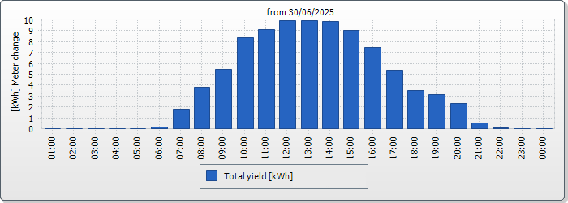

# Sunny Portal Daily Chart

A command-line tool to extract energy production data from SunnyPortal daily chart images.



## Description

This tool extracts hourly energy production data from SunnyPortal daily chart images. These are contained in the email that you can configuration in your SMA portal. It analyzes the chart by detecting the dark blue pixels that represent the energy production for each hour of the day, and calculates the generation in watt-hours.

The tool can output the data in different formats:

- **Console output (default):** Displays the hourly energy production in a human-readable format
- **InfluxDB format:** Outputs the data in a format suitable for importing into InfluxDB

## Installation

Ensure you have Rust installed on your system. Then build the project using Cargo:

```bash
cargo build --release
```

The compiled binary will be available at `target/release/sunnyportal-daily-chart`.

## Usage

### Basic Usage

```bash
./sunnyportal-daily-chart chart.png
```

This will display the hourly energy production data from the provided chart image.

### Example Output (Console Format)

```text
00     0 Wh
01     0 Wh
02     0 Wh
03     0 Wh
04     0 Wh
05   148 Wh
06  1765 Wh
07  3750 Wh
08  5368 Wh
09  8236 Wh
10  8971 Wh
11  9780 Wh
12  9780 Wh
13  9706 Wh
14  8898 Wh
15  7353 Wh
16  5295 Wh
17  3456 Wh
18  3089 Wh
19  2280 Wh
20   515 Wh
21    74 Wh
22     0 Wh
23     0 Wh

Maximum Watt in chart: 10000 Wh
Total: 88464 Wh
```

### Example Output (InfluxDB Format)

```text
sunnyportal_daily_chart generation=0 0
sunnyportal_daily_chart generation=0 1
sunnyportal_daily_chart generation=0 2
...
sunnyportal_daily_chart generation=9780 12
...
sunnyportal_daily_chart generation=0 23
```

## Command Line Parameters

```text
Usage: sunnyportal-daily-chart [OPTIONS] <CHART_FILE>

Arguments:
  <CHART_FILE>  Path to the daily chart image file

Options:
  -t, --total            Show total and a summary of the data
  -w, --writer <WRITER>  Writer to use for output [default: console] [possible values: console, influx]
  -h, --help             Print help
  -V, --version          Print version
```

### Parameters Explained

- `<CHART_FILE>`: Path to the SunnyPortal daily chart image (required)
- `-t, --total`: Show additional information including the maximum power and total energy production
- `-w, --writer`: Output format to use
  - `console` (default): Human-readable console output
  - `influx`: Format suitable for InfluxDB

## How It Works

The tool analyzes the image by:

1. Scanning the image to determine the maximum power value in the chart
2. For each hour (x-coordinate), scanning vertically to find dark blue pixels representing the chart line
3. Calculating the energy production based on the vertical position of the chart line
4. Converting pixel heights to watt-hours using the determined chart scale

## Requirements

- The chart image must be 700x250 pixels
- The chart must use dark blue (#1D4B91) color for the energy production line

## Correctness

The extracted data is per design not 100% correct. The numeric data is sampled down to create the chart and this software reads it again. Goal was not to have full accuracy, but to get a feeling of the sun's intensity over one day.

## License

[MIT License](LICENSE)